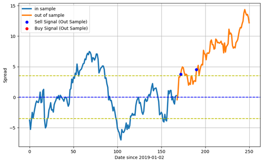

# Dynamic-Trading-Strategy-Design

## Introduction
In the finance world, there are lots of trading techniques that help maximize profit or minimize risk. Pair Strategy is one of the common trading strategies that matches a long position and a short position in two stocks with a high correlation. The two-offsetting position forms a hedging strategy that seeks opportunity from either a positive trend or a negative trend. Based on the theory, the pair stocks will maintain a specific correlation. Once the pair stocks trade deviate, investors can seek the opportunity to buy or sell their stock. Among the top 100 stocks, I choose NVDA, AMD, and TSM as my pair strategy and improved pair strategy stocks. The biggest commonality is that they are all in the semiconductor industry. NVDA and AMD are the top 2 biggest semiconductor companies in the world, and TSM is one of the biggest semiconductor manufacturing companies in the world, which has been working with both companies frequently. Besides the company’s strong relationship, they also show a high correlation with each other statistically. From 2019 to 2020, the companies’ correlations are over 50%. Also, the stocks all grow in a positive trend. The goal of the project is to estimate NVDA prices based on AMD and TSM stock prices using the Ordinary Least Square method. There are two trading designs. One is the NVDA – AMD pair strategy. Second is the NVDA – AMD – TSM improved pair strategy. The two designs are evaluated by the total return in three-month trading periods. The result showed that the improved pair strategy has better performance (more return) by including more relevant and high-correlation stock information. 

## Dataset
The stock data is downloaded from Yahoo Finance API from 1/1/2019 to 12/31/2019. The data does not have missing value, so there are no further steps to clean the data. In the data, it has basic trading information: Open, Close, Low, High, Adj Close, and Volume. To be simple, I used close price as my final stock for each day and combined all the stock prices together into one data frame. 

## Data Preprocessing
The dataset for both pair and extended pair strategies is not high-dimensional. In OLS, there is only one or two independent variables. Each variable has a great influence on predicting the target variable. Thus, we do not need to exploit dimension-reduction techniques like PCA to scale the non-important variables. For normalization, there is no significant difference between normalization and standardization in pair trading. Normalization and standardization are used to scale data without distorting differences in the range of values. It also helps make the numerical data more interpretable. In the stock market, the price is already interpretable and does not require further transformation.

 

*Figure 1 Stock Price from 1/1/2019 - 8/31/2019*

## Methodology
The mean-reversion strategy is a financial theory that asset prices eventually will revert to their long-term mean or average level. The theory not only applies to price, but also to other financial phenomena such as volatility of returns, growth rate, or economic ratios. The strategy of the mean-reversion strategy is to buy when the current price is lower than the average past price and sell when the current price is higher than the average past price.
Pair trading is a common trading strategy that finds two highly correlated securities, like stocks, bonds, or currencies, which move in the same direction over a long period. It will maintain its relationship over time, and any deviation from the relationship presents a trading opportunity. In a pair trading strategy, if the divergent is not significant enough, the trading may not be worth it, which may offset the transactional cost. In general, the short and long signal is set one standard deviation away from the mean. 
In my trading design, the trading signal line is set one standard deviation above and below the mean of in-sample data. If the spread reaches the upper line, it indicates that NVDA’s price is higher than the predicted price. It could also mean that the NVDA is overvalued, or AMD is undervalued. Thus, it will be a short signal for NVDA and a long signal for AMD. If the spread reaches the lower line, it suggests that the NVDA price is lower than the predicted price. It indicates that the NVDA is undervalued, and AMD is overvalued. Thus, it will be a long signal for NVDA and a short signal for AMD. 

## Experiments
There are four experiments: pair strategy with in-sample data, pair strategy with out-sample data, improved pair strategy with in-sample data, and improved pair strategy with out-sample data. The in-sample data is collected from 1/1/2019 to 8/31/2019, and out-sample data is collected from 9/1/2019 to 12/31/2019. The trading design is to estimate the NVDA price using OLS using in-sample data. To be fair in computing total return, in-sample data will only be tested for the first three months, and each experiment starts with ten shares of NVDA stock. When encountering a trading signal, the system will buy/sell stock at the current price. The system will sell the rest of the stock with the ending price. The baseline strategy is to do nothing and sell all the stock in the end. The total return is compared by summing all the profits of each stock. This method does not trade the stock in the optimal execution that the total return is not optimized. However, the experiment can still compare the two strategies by their performance. 

 
 
*Figure 2 NVDA - AMD Spread*

## Results
The results show the extended pair strategy outperforms the pair trading strategy. Both trading designs have roughly 117 total returns in in-sample data, which is slightly more than the baseline 108. In out-sample data, the pair strategy earns less than the baseline. It shows that the pair strategy performs worse than doing nothing. On the other hand, the extended pair strategy earns the most with almost 200. 

Baseline in-sample: 108.349
Pair strategy in-sample: 117.102
Pair strategy out-sample: 144.667
Baseline out-sample: 170.375
Extended pair strategy in-sample: 117.954
Extended pair strategy out-sample: 199.167

 
 
*Figure 3 NVDA-AMD Spread (Out-Sample)*

 
*Figure 4 NVDA-AMD-TSM Spread (Out-Sample)*

## Conclusion
Based on the result, we can draw several conclusions. In Figure 3, we can see that the pair strategy gives 2 sell signals in the later year, which the price is going higher. Instead, the extended pair strategy gives 2 buy signals in the later year (figure 4). It shows that adding TSM stock information does help the system to make better trading decisions. In extended strategy, the model not only includes AMD, the biggest rival of Nvidia but also includes partner company TSMC stock information to help estimate Nvidia stock price, making this trading strategy to learn Nvidia stock from multiple aspects. It resulted in better trading decisions. To sum up, the improved version of the pair strategy performs better than the basic pair strategy. In the future, it is possible to include more relative stocks to help predict stock prices and improve the pair trading strategy. With more independent variables, the OLS may need a dimension reduction technique to reduce variables and find the most fit variables to predict the price. 

## References
https://www.investopedia.com/articles/trading/04/120804.asp

https://www.investopedia.com/terms/p/pairstrade.asp#:~:text=Key%20Takeaways-,A%20pairs%20trade%20is%20a%20trading%20strategy%20that%20involves%20matching,group%20of%20technical%20analyst%20researchers

https://www.cmcmarkets.com/en/trading-guides/mean-reversion#:~:text=Mean%20reversion%20is%20a%20financial,average%20price%20over%20and%20over
